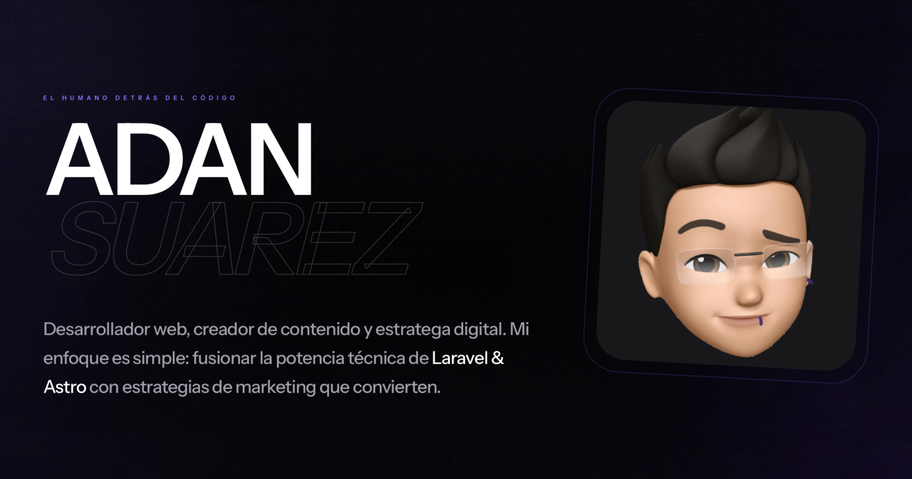

## 🚀 Acerca de mí
- 🔭 Actualmente trabajando en: **Noctua**, un proyecto ambicioso de entrenamiento y capacitación de agentes de ventas para empresas
- 💬 Pregúntame sobre: Laravel, arquitectura de aplicaciones, Blade, Livewire y buenas prácticas
- ⚡ Curiosidad: me obsesiona mantener el código limpio y fácil de entender

## 🛠️ Tecnologías y herramientas
- **Lenguaje:** PHP
- **Backend:** Laravel
- **Frontend:** Blade, Livewire
- **Bases de datos:** MySQL
- **Infraestructura:** VPS, cPanel, Plesk
- **Herramientas:** Git, GitHub, Trello, Notion, Affinity Designer, VS Code

## ✨ Proyectos destacados
- **Noctua** — [Noctua AI](https://noctuaroleplay.com/) Plataforma de entrenamiento y capacitación para agentes de ventas en empresas, con cursos especializados en ventas.
- **Sistemas web a medida** — Aplicaciones internas y plataformas administrativas desarrolladas con Laravel.
- **Sitio personal** — [https://adansc.dev](https://adansc.dev)

_(Fija aquí los repositorios que quieras destacar en tu perfil)_

## 📫 Cómo contactarme
- 🌐 Web: [https://adansc.dev](https://adansc.dev)
- 💼 LinkedIn: [LinkedIn](https://www.linkedin.com/in/adansc)
- 📧 Email: [hola@adansc.dev](mailto:hola@adansc.dev)

## 🧾 Más
- ✨ Desarrollo soluciones a medida con enfoque en calidad, escalabilidad y mantenimiento.
- 🔗 Mis repositorios de GitHub son privados, pero puedes ver mis proyectos en [https://adansc.dev/](https://adansc.dev/).

<!--

-->
